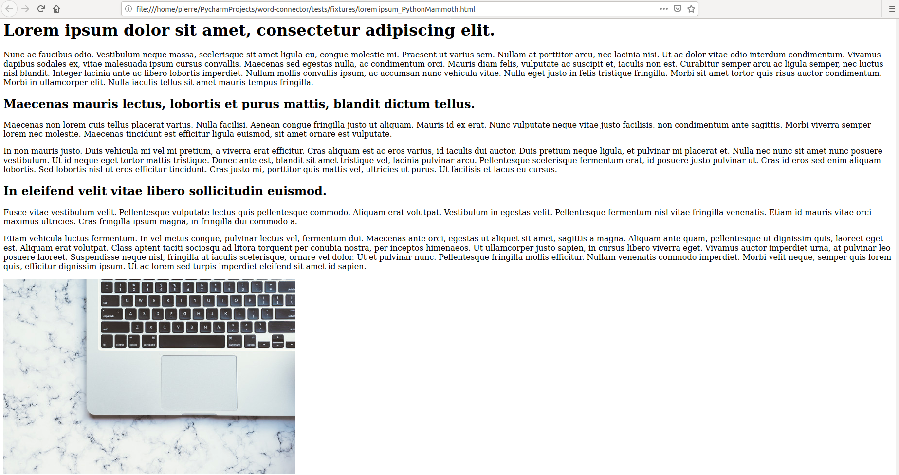
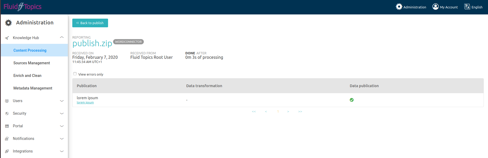
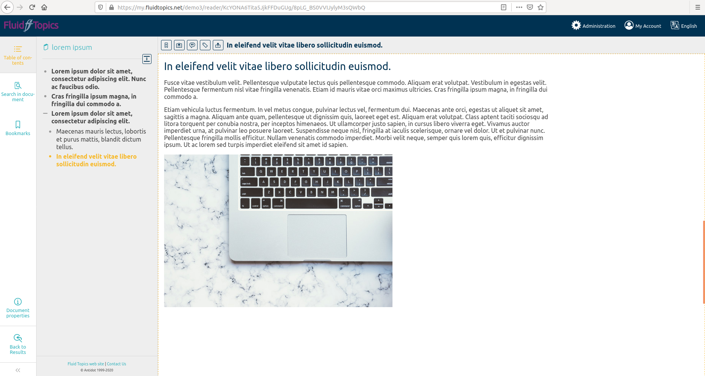

# HTML connector

This connector makes it possible to publish HTML files to a Fluid Topics tenant from
a local machine or anything that can run Python 3. It automatically creates a Table
of Contents based on the content of the HTML file. The result should
be available in Fluid Topics as soon as the content is processed.

# Example

For an HTML file `lorem.html`:




And with a Fluid Topics tenant up and running at "my.fluidtopics.tenant.url".
It is necessary to have a working local Python environment and to have
installed the HTML connector (see "Installing").

```bash
# Send "lorem.html" to the FT tenant
html2ft lorem.html --url my.fluidtopics.tenant.url --login my@ddress.com --password mypassword
```

The publishing run is visible in the Knowledge Hub:



And the document is published to Fluid Topics with an automatically generated Table of Contents:



# Installing

## Client

It is necessary to have a working local Python 3 environment.

For example, if running MacOs, it is necessary to install pip3 with `brew install pip3`.

```bash
pip3 install antidot-html-connector
```

## FT Server

Add the external source with the ID = `HTMLConnector`. Please
make it known [here](https://jira.antidot.net/browse/FT-4795)
if you want to not have to do that.

# Usage

## Using as a binary

The `html2ft` binary will publish the HTML document to your Fluid Topics
tenant and create its Table of Contents automatically.

```
html2ft path/to/file.html --url my.fluidtopics.tenant.url --login my@ddress.com
```

It is possible to add the `--verbose` or `--password myStr0ngP@ssword` options.

## Using as a library

### Sending directly to FT

To send data directly to Fluid Topics:

```python
from antidot.connector.html import publish_html

publish_html("path/to/file.html", "my.fluidtopics.tenant.url", "my@ddress.com", "myStr0ngP@ssword")
```

It is also possible to use a Client object from the `fluidtopics` package:

```python
from fluidtopics.connector import RemoteClient
from antidot.connector.html import publish_html_with_client

client = RemoteClient("my.fluidtopics.tenant.url", "my@ddress.com", "myStr0ngP@ssword", "mySourceID")
publish_html_with_client("path/to/file.html", client=client)
```

### Getting intermediary publication objects

To get publications from the HTML file:

```python
from antidot.connector.html import html_to_fluid_api

publication = html_to_fluid_api("path/to/file.html", "Publication title")
```

When using the function that returns publications, it is possible to use a decorator
for the connection:

```python
from datetime import datetime

from fluidtopics.connector import LoginAuthentication, Metadata, Publication, RemoteClient
from antidot.connector.generic.decorators import ClientAuthentication, LoginAndPasswordAuthentication
from antidot.connector.html import html_to_fluid_api

url = "my.fluidtopics.tenant.url"
login = "my@ddress.com"
password = "myStr0ngP@ssword"
source_id = "MySourceId"

@ClientAuthentication(RemoteClient(url, LoginAuthentication(login, password)), source_id)
def html_to_fluid_api_ftml_plugin(html_path) -> list[Publication]:
    metadatas = [
        Metadata.last_edition(datetime.now().strftime("%Y-%m-%d")),
        Metadata.string("uploader", ["ClientAuthentication"]),
        Metadata.string("use_ftml", ["Yes"]),
    ]
    return html_to_fluid_api(html_path=html_path, metadatas=metadatas, use_ftml=True)

@LoginAndPasswordAuthentication(url, login, password, source_id)
def html_to_fluid_api_plugin(html_path) -> list[Publication]:
    metadatas = [
        Metadata.last_edition(datetime.now().strftime("%Y-%m-%d")),
        Metadata.string("uploader", ["LoginAndPasswordAuthentication"]),
        Metadata.string("use_ftml", ["No"]),
    ]
    return html_to_fluid_api(html_path=html_path, metadatas=metadatas, use_ftml=False)
```

## Optional arguments

### Rendering the cover page

A render_cover_page option is available.

```python
from fluidtopics.connector import RemoteClient

from antidot.connector.html import html_to_fluid_api, publish_html, publish_html_with_client

publish_html(
    "path/to/file.html",
    "my.fluidtopics.tenant.url",
    "my@ddress.com",
    "myStr0ngP@ssword",
    use_ftml=True
)
publish_html_with_client(
    "path/to/file.html",
    RemoteClient("my.fluidtopics.tenant.url", "my@ddress.com", "myStr0ngP@ssword", "mySourceID"),
    use_ftml=True,
)
publication = html_to_fluid_api("path/to/file.html", "My title", use_ftml=True)
```

For the binary, it's `--render-cover-page`.

### Adding metadata

It is also possible to add metadata to the publication by providing a
list of metadata with the metadatas parameter:

```python
from datetime import datetime

from fluidtopics.connector import Metadata, RemoteClient

from antidot.connector.html import html_to_fluid_api, publish_html, publish_html_with_client

use_ftml = True
metadatas = [
    Metadata.string("splitting_algorithm", ["ftml" if use_ftml else "default"]),
    Metadata.last_edition(datetime.now().strftime("%Y-%m-%d")),
]
publish_html(
    "path/to/file.html",
    "my.fluidtopics.tenant.url",
    "my@ddress.com",
    "myStr0ngP@ssword",
    use_ftml=use_ftml,
    metadatas=metadatas,
)
publish_html_with_client(
    "path/to/file.html",
    RemoteClient("my.fluidtopics.tenant.url", "my@ddress.com", "myStr0ngP@ssword", "mySourceID"),
    metadatas,
    use_ftml,
)
publication = html_to_fluid_api("path/to/file.html", "Publication title", use_ftml=True, metadatas=metadatas)

```

### Optional FTML splitting algorithm

To publish FTML, it is also necessary to install the FTML connector:

```bash
pip3 install antidot-fluidtopics-ftml-connector -i https://pypi.mrs.antidot.net/antidot/stable/
```

Once the connector is installed, the binary with the `--use-ftml` option is available.

To add the `use_ftml` parameter:

```python
from antidot.connector.html import publish_html, publish_html_with_client, html_to_fluid_api
from fluidtopics.connector import RemoteClient

url = "my.fluidtopics.tenant.url"
login = "my@ddress.com"
password = "myStr0ngP@ssword"
source_id = "MySourceId"
html_path = "path/to/file.html"
title = "My Title"

publish_html(html_path, url, login, password, use_ftml=True)
publish_html_with_client(html_path, RemoteClient(url, login, password, source_id), use_ftml=True)
publication = html_to_fluid_api(html_path, title, use_ftml=True)
```

# Development

[](https://scm.mrs.antidot.net/copro/html-connector/commits/master)
[](https://github.com/ambv/black)
[](http://makeapullrequest.com)

```bash
python3 -m venv venv
source venv/bin/activate
# Use
pip3 install -e .
html2ft -h
# Test
pip3 install -e ".[test]"
python3 -m pytest . --cov=antidot --cov-report html --verbose -vv
xdg-open htmlcov/index.html
```
